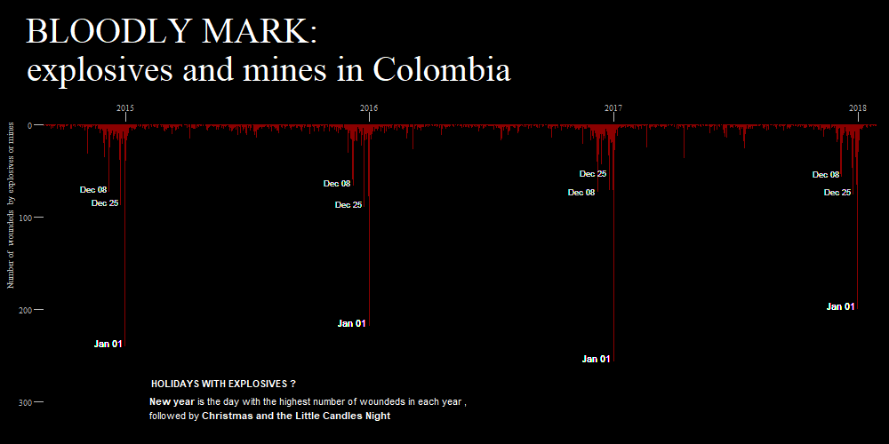

## Description
The aim of this project is to design a plot about the patterns of daily wounds by explosives and mines in Colombia.

## Data source
- **Cases' data:** Cases were taken from [the colombian survelliance system (SIVIGILA)](http://portalsivigila.ins.gov.co/Paginas/Buscador.aspx). 

## Files' description
- **Code:** Folder with the codes used.
   - **1. Getting_and_wrangling_data.R:** strategy to download, unzip, read, and wrangle the cases' data.
   - **2. Plot_English.R:** Strategy to create the plot in English.
- **Plot_English.png:** png of the plot created.
 

